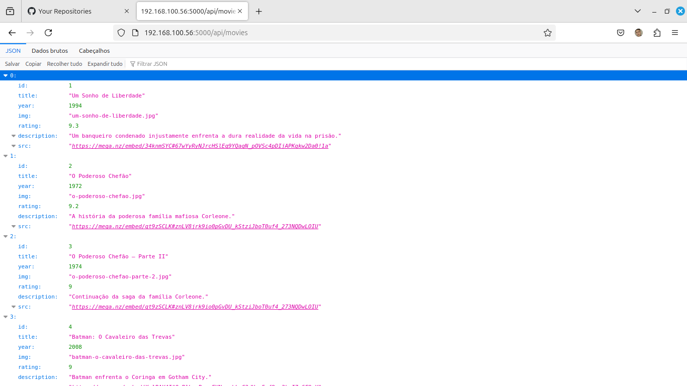

# Movie API

Este projeto é uma API simples que permite gerenciar uma lista de filmes, oferecendo funcionalidades para obter, adicionar e curtir filmes de forma eficiente.

## Tecnologias Utilizadas

- *Node.js*: Ambiente de execução para JavaScript no lado do servidor.
- *Express*: Framework para construção de APIs e aplicações web.
- *CORS*: Middleware que permite o controle de acesso entre domínios.
- *JavaScript*: Linguagem de programação utilizada no desenvolvimento.

## Pré-requisitos

- *Node.js*: Versão 12 ou superior.

## Instalação

Siga os passos abaixo para executar o projeto localmente:

1. *Clone o repositório*
   git clone https://github.com/jonatasem/api-movies.git
   cd api-movies
   
2. *Instale as dependências*
   npm install
   
3. *Inicie o servidor*
   npm start
   

Após iniciar o servidor, ele estará disponível em http://localhost:5000.

## Endpoints

### 1. GET /api/movies

- *Descrição*: Retorna a lista de todos os filmes cadastrados.
- *Resposta*: Um array de objetos, onde cada objeto representa um filme.

### 2. Documentação da API: /api-docs

- *Descrição*: Acesse a documentação interativa da API utilizando Swagger UI.
- *Uso*: Navegue até http://localhost:5000/api-docs em seu navegador para visualizar e interagir com os endpoints disponíveis.

## Licença

Este projeto está licenciado sob a MIT License.